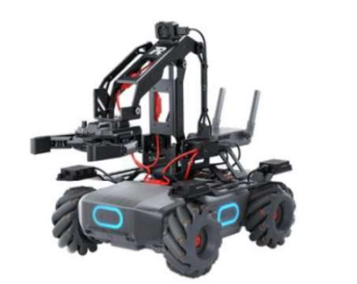

# MobileRobot-Openloopcontrol
## Aim:

To develop a python control code to move the mobilerobot along the predefined path.

## Equipments Required:
1. RoboMaster EP core
2. Python 3.7

## Procedure

Step1:

Initiate the mobile robot.

Step2:

Connect your PC with the mobile robot through Wi-Fi.

Step3:

Open batter_level.py file and check the battery.

Step4:

Open the other python files and program the movements of robo using python.

Step5:

Execute the python program and record the movements.

## Program
```python
from robomaster import robot
import time

if __name__ == '__main__':
    ep_robot = robot.Robot()
    ep_robot.initialize(conn_type="ap")

    ep_chassis = ep_robot.chassis
    ep_led = ep_robot.led
    ep_camera = ep_robot.camera

    print("Video streaming started.....")
    ep_camera.start_video_stream(display=True, resolution = camera.STREAM_360P)

    ep_chassis.move(x=0.6, y=0, z=0, xy_speed=1.5).wait_for_completed()
    ep_led.set_led(comp = "all",r=255,g=0,b=255,effect="on")

    ep_chassis.move(x=0.3, y=0, z=-80, xy_speed=1.5).wait_for_completed()
    ep_led.set_led(comp = "all",r=0,g=255,b=255,effect="on")

    ep_chassis.move(x=2.1, y=0, z=0, xy_speed=1.3).wait_for_completed()
    ep_led.set_led(comp = "all",r=255,g=0,b=0,effect="on")


    ep_chassis.move(x=0, y=1.4, z=0, xy_speed=1.3).wait_for_completed()
    ep_led.set_led(comp = "all",r=255,g=102,b=0,effect="on")

    ep_chassis.move(x=0, y=0, z=30, xy_speed=0).wait_for_completed()
    ep_led.set_led(comp = "all",r=0,g=255,b=255,effect="on")

    ep_chassis.move(x=-1.2, y=0, z=0, xy_speed=1.3).wait_for_completed()
    ep_led.set_led(comp = "all",r=255,g=0,b=255,effect="on")

    ep_chassis.move(x=0, y=0, z=133, xy_speed=1.3).wait_for_completed()
    ep_led.set_led(comp = "all",r=255,g=255,b=0,effect="on")

    ep_chassis.move(x=0, y=-1.5, z=0, xy_speed=1.3).wait_for_completed()
    ep_led.set_led(comp = "all",r=255,g=255,b=0,effect="on")

    ep_chassis.move(x=0, y=0, z=35, xy_speed=1.3).wait_for_completed()
    ep_led.set_led(comp = "all",r=255,g=0,b=255,effect="on")

    ep_chassis.move(x=1, y=0, z=0, xy_speed=1.3).wait_for_completed()
    ep_led.set_led(comp = "all",r=102,g=0,b=255,effect="on")

    
    ep_chassis.move(x=0, y=0.6, z=0, xy_speed=1.3).wait_for_completed()
    ep_led.set_led(comp = "all",r=51,g=51,b=0,effect="on")

    ep_chassis.move(x=0, y=0, z=-118, xy_speed=1.3).wait_for_completed()
    ep_led.set_led(comp = "all",r=204,g=153,b=255,effect="on")

    ep_chassis.move(x=2.4, y=0, z=0, xy_speed=1.3).wait_for_completed()
    ep_led.set_led(comp = "all",r=51,g=102,b=255,effect="on")

    ep_chassis.move(x=0, y=0, z=0, xy_speed=1.3).wait_for_completed()
    ep_led.set_led(comp = "all",r=128,g=102,b=255,effect="on")


    time.sleep(4)
    ep_camera.stop_video_stream()
    print("Stopped video streaming.....")

    ep_robot.close()

```

## MobileRobot Movement Image:


Insert image here




## MobileRobot Movement Video:

Upload your video in Youtube and paste your video-id here

https://youtu.be/BVjvmbwNWxc?si=cjNxnapBef4mgWqX

## Result:
Thus the python program code is developed to move the mobilerobot in the predefined path.


```
Mobile Robotics Laboratory
Department of Artificial Intelligence and Data Science/ Machine Learning
Saveetha Engineering College
```
